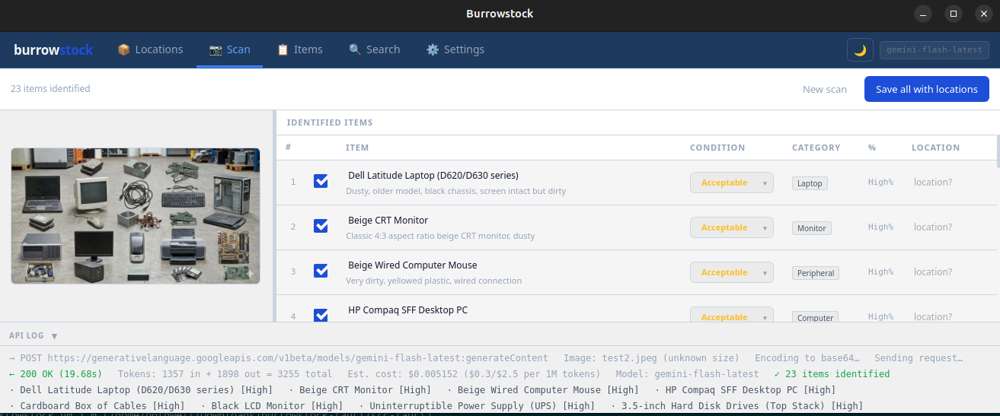
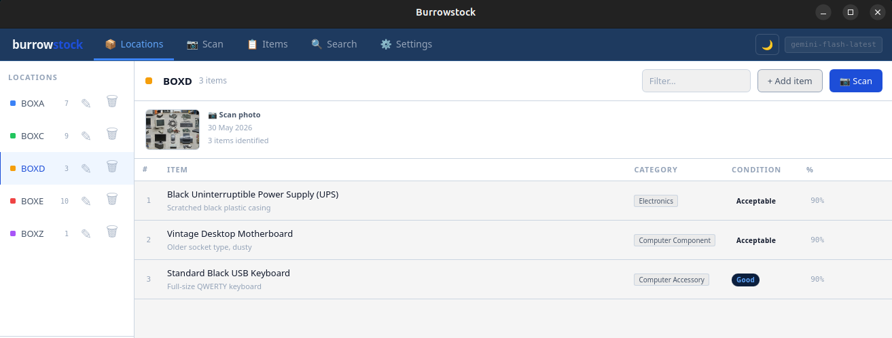
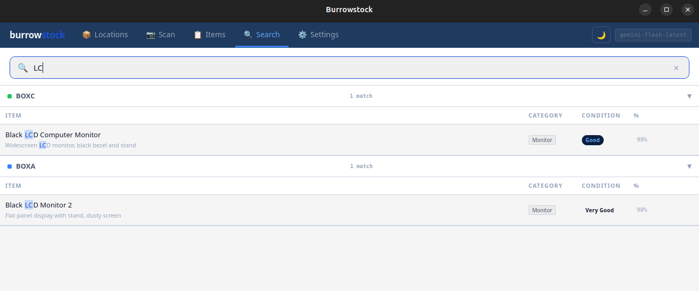
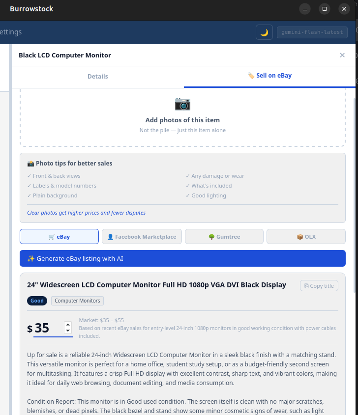
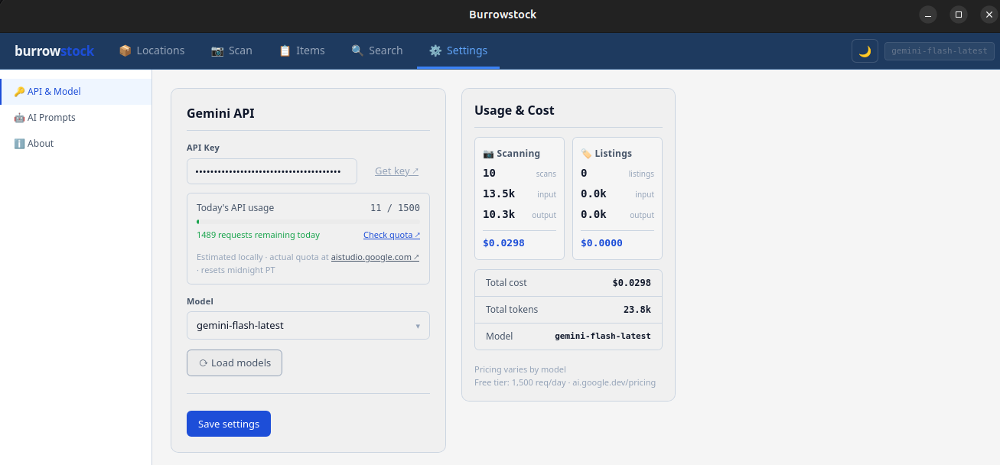

# burrowstock

> Snap it. Burrow it. Find it. Sell it.

A local-first desktop app for cataloguing physical items using AI vision. Photograph your pile of junk, let Gemini identify every item, organise by location, search instantly, and generate marketplace listings in seconds.

Built with Tauri v2 + Rust. Sub-second startup. No cloud. No accounts. No subscription.

---

## Screenshots

**📷 AI Scan — photograph a pile, Gemini identifies every item**


**📦 Locations — organise your catalog by box, shelf, or room**


**🔍 Search — find anything across all locations instantly**


**🏷️ Listing generator — AI writes your eBay/Gumtree/Facebook listing**


**⚙️ Settings — BYOK Gemini API, usage tracking, AI prompts**


---

## Quick start

```bash
git clone https://github.com/block0xhash/burrowstock.git
cd burrowstock
cargo install tauri-cli --version "^2.0"
cargo tauri dev
```

First run compiles Rust (~3 minutes). After that, starts in under a second.

---

## Prerequisites

### All platforms
```bash
# Rust (if not installed)
curl --proto '=https' --tlsv1.2 -sSf https://sh.rustup.rs | sh
```

### Linux (Ubuntu/Debian)
```bash
sudo apt install \
  libwebkit2gtk-4.1-dev \
  libgtk-3-dev \
  libayatana-appindicator3-dev \
  librsvg2-dev \
  patchelf
```

### macOS
```bash
xcode-select --install
```

### Windows

> ⚠️ **MSYS2/MinGW is not supported.** Tauri's debug build exceeds the Windows DLL export limit (65535) which both GNU ld and lld enforce. MSVC is required.

**Step 1 — Install rustup (if using MSYS2, run this inside it):**
```bash
curl -o rustup-init.exe https://win.rustup.rs/x86_64
./rustup-init.exe
# Choose option 1 (default) — installs MSVC toolchain
```

**Step 2 — Open PowerShell (not MSYS2) and install build tools:**
```powershell
winget install Microsoft.VisualStudio.2022.BuildTools
# During install select: "Desktop development with C++"
```

**Step 3 — Run in PowerShell:**
```powershell
cd path	ourrowstock
cargo tauri dev
```

WebView2 is pre-installed on Windows 11. If missing:
```powershell
winget install Microsoft.EdgeWebView2Runtime
```

---

## Get a Gemini API key

1. Go to [aistudio.google.com](https://aistudio.google.com/apikey)
2. Sign in with a Google account
3. Click **Create API key**
4. Open Burrowstock → Settings → API & Model → paste key → Save

**Free tier:** 1,500 requests/day · 15 requests/minute · No credit card required

---

## What it does

### 📷 AI-Powered Scanning
Photograph a pile of items — a box of electronics, a shelf of tools, a wardrobe. Gemini Vision identifies every single item visible, even partially hidden ones. One photo can yield 20+ catalogued items in seconds.

- Identifies brand, model, generation, ports (for IT hardware)
- Notes condition, colour, size, visible defects
- Assigns eBay-standard conditions: Brand New / Like New / Very Good / Good / Acceptable
- Shows confidence score per item
- Tracks tokens used and estimated API cost per scan

### 📦 Location Catalog
Organise your inventory by physical location — boxes, shelves, rooms, storage units.

- Create unlimited locations with colour coding
- Inline rename and delete with confirmation
- Each location stores the original scan photo
- Click the scan photo thumbnail to open a full zoom/pan modal
- Filter items within a location instantly

### 🔍 Full-Text Search
Find anything across your entire catalog instantly using SQLite FTS5.

- Search by item name, notes, category, or location
- Results appear as you type with 150ms debounce
- Matching text highlighted in results
- Results grouped by location, collapsible
- Handles thousands of items with no slowdown

### 🏷️ AI Listing Generator
Select an item, add individual photos, and generate a complete marketplace listing.

- Supports: **eBay**, **Facebook Marketplace**, **Gumtree**, **OLX**
- AI writes keyword-rich titles (max 80 chars for eBay)
- Full description with honest condition report
- Market-based price estimate with low/high range
- Copy listing to clipboard — paste anywhere
- Platform-specific format (formal for eBay, casual for Facebook)

### ✏️ Item Management
- Click any item to open detail panel
- Edit name, condition, location, notes inline
- Move items between locations
- Rename and delete with confirmation modals

### 🔒 Privacy
Everything stays on your machine. The only outbound connection is to `generativelanguage.googleapis.com` when you scan or generate a listing. No telemetry. No analytics. No accounts.

---

## Stack

| Layer | Technology |
|---|---|
| Desktop shell | Tauri v2 |
| Backend | Rust |
| Database | SQLite + FTS5 (rusqlite) |
| AI Vision | Google Gemini API |
| UI | Vanilla JS + CSS — no framework |

No npm. No node_modules. No Electron. No bundler.

---

## Build release binary

```bash
cargo tauri build
```

Output in `src-tauri/target/release/bundle/`:

| Platform | File |
|---|---|
| Linux | `burrowstock_0.1.0_amd64.AppImage` |
| macOS | `burrowstock_0.1.0_aarch64.dmg` |
| Windows | `burrowstock_0.1.0_x64-setup.exe` |

---

## Project structure

```
burrowstock/
├── src/
│   ├── index.html          # App shell
│   ├── app.js              # All UI — state, render, events
│   ├── app.css             # Styles — dark/light theme
│   └── tauri-bridge.js     # window.bs.* — JS to Tauri IPC
└── src-tauri/
    ├── src/
    │   ├── main.rs         # Entry point
    │   ├── lib.rs          # Tauri commands + bslocal:// protocol
    │   ├── db.rs           # SQLite schema, migrations, FTS5
    │   └── vision.rs       # Gemini API — scanning + listing generation
    ├── capabilities/
    │   └── default.json    # Tauri security capabilities
    ├── Cargo.toml
    └── tauri.conf.json
```

---

## Roadmap

**v1 (current)** — Scan, catalog, search, generate listings, copy to clipboard

**v2** — One-click post to eBay via OAuth, Facebook Marketplace integration, $9/month or $79 lifetime

**v3** — Mobile companion app for item photos, cloud sync (optional, encrypted)

---

## License

MIT — do whatever you want with it.
